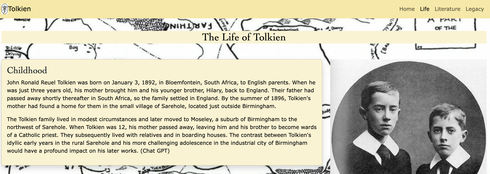

TOLKIEN

# [TOLKIEN MS1](https://ironmonkeynuts.github.io/Tolkien-MS1)

Project Idea - Fansite for J.R.R. Tolkien
Build a biographical site for the life and works of J.R.R. Tolkien.

External user’s goal:
The site's users are general public who are interested in learning about the life and work of Tolkien.

Site owner's goal:
Generate interest in the person Tolkien and his works. Create further interest in reading his work and seeing content related to Tolkien.

Potential features to include:
Tell about the early personal life of Tolkien, his struggles, his love and his loss.

Tell about the work of Tolkien including his academic writing on history and linguistics, his development of fictional languages, his poetry, his short fictional stories and his grand stories based in the fictional Middle-earth world.

Tell about the legacy of tolkien's work and how it has impacted in popular culture including, film, music, other authors, gaming and the general popular culture.

Showcase photos, audio and/or video clips of his work or other artists imspired by his work.

Provide links to external resources, including the Tolkien Foundation, film franchises and other fan sites.

source: [amiresponsive](https://ui.dev/amiresponsive?url=https://ironmonkeynuts.github.io/Tolkien-MS1)

## UX

This website was designed with an initial welcoming page outlining the scope and purpose of the website leading to three information pages:

The Life of Tolkien, detailing important stages in his life in chronological order.

The Work of Tolkien, outlining all aspects of his writing and including his art work.

The legacy of Tolkien, demonstrating the impact of Tolkien's work on culture including film, other authors, music, artwork and gaming.

A navbar runs through all pages allowing access to all pages consistently. Bootsrap 5 has been used to create a navbar.

A footer replicated on each page allows access to some notable and relevant external websites. It laso includes a form box to subscribe to an emailed newsletter. 

Styling and position has been kept consistent to enable familiar and comfortable accessibility. Bootstrap 5 has been employed to assist in most styling actions

### Colour Scheme

- `#000000` used for primary text and secondary text.
- `#f9e79f` used for background color in navbar and footer of each page.
- `#fcf3cf` used for background color throughout main of each page, labelled in class .brand-color.

### Typography

The primary text has a font family consisting of Verdana, Geneva, Tahoma, and sans-serif. These are readily available to the public and provide a clear text. 

The headings use a font family consisting of Cambria, Cochin, Georgia, Times, 'Times New Roman'and serif. This contrasts with the primary text font and provide a text appearance that fits with Tolkien themes.

## User Stories

### New Site Users

- As a new site user, I would like to ____________, so that I can ____________.

### Returning Site Users

- As a returning site user, I would like to ____________, so that I can ____________.

