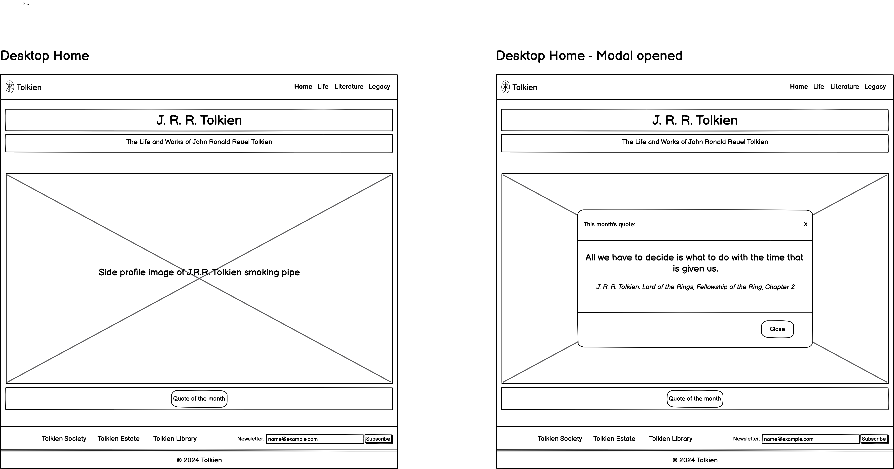
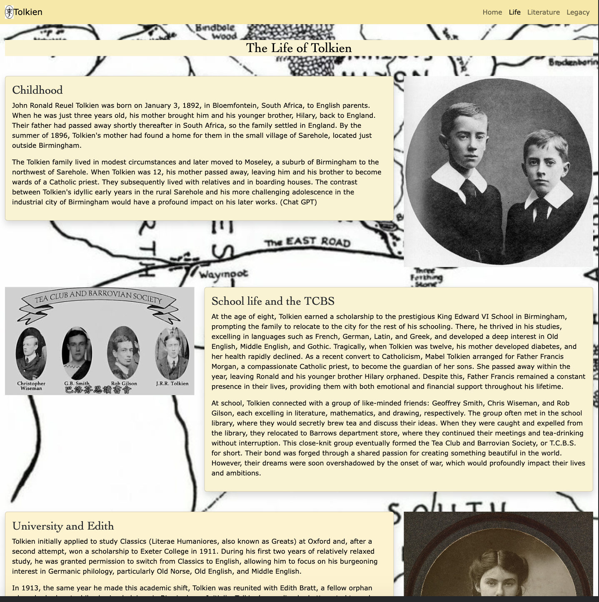

TOLKIEN

# [TOLKIEN MS1](https://ironmonkeynuts.github.io/Tolkien-MS1)

Project Idea - Fansite for J.R.R. Tolkien
Build a biographical site for the life and works of J.R.R. Tolkien.

External user’s goal:
The site's users are general public who are interested in learning about the life and work of Tolkien.

Site owner's goal:
Generate interest in the person Tolkien and his works. Create further interest in reading his work and seeing content related to Tolkien.

Potential features to include:
Tell about the early personal life of Tolkien, his struggles, his love and his loss.

Tell about the work of Tolkien including his academic writing on history and linguistics, his development of fictional languages, his poetry, his short fictional stories, his grand stories based in the fictional Middle-earth world and his artwork.

Tell about the legacy of tolkien's work and how it has impacted in popular culture including, film, music, other authors, gaming and the general popular culture.

Showcase photos, audio and/or video clips of his work or other artists imspired by his work.

Provide links to external resources, including the Tolkien Society, the Tolkien Estate, the Tolkien Library, and in the futurelinks to film franchises and other fan sites.

source: [amiresponsive](https://ui.dev/amiresponsive?url=https://ironmonkeynuts.github.io/Tolkien-MS1)

## UX

This website was designed with an initial welcoming page outlining the scope and purpose of the website leading to three information pages:

The Life of Tolkien, detailing important stages in his life in chronological order.

The Work of Tolkien, outlining all aspects of his writing and including his art work.

The legacy of Tolkien, demonstrating the impact of Tolkien's work on culture including film, other authors, music, artwork and gaming.

A navbar runs through all pages allowing access to all pages consistently. Bootsrap 5 has been used to create a navbar.

A footer replicated on each page allows access to some notable and relevant external websites. It laso includes a form box to subscribe to an emailed newsletter. 

Styling and position has been kept consistent to enable familiar and comfortable accessibility. Bootstrap 5 has been employed to assist in most styling actions

### Colour Scheme

- `#000000` used for primary text and secondary text.
- `#f9e79f` used for background color in navbar and footer of each page.
- `#fcf3cf` used for background color throughout main of each page, labelled in class .brand-color.

### Typography

The primary text has a font family consisting of Verdana, Geneva, Tahoma, and sans-serif. These are readily available to the public and provide a clear text. 

The headings use a font family consisting of Cambria, Cochin, Georgia, Times, 'Times New Roman'and serif. This contrasts with the primary text font and provide a text appearance that fits with Tolkien themes.

## User Stories

### New Site Users

- As a new site user, I would like a clear indication of the scope of this site, so that I may know what to expect and whether it meets my needs.
- As a new site user, I would like a simple navigation and heading structure, so that I can easily find particular content I am interested in.

### Returning Site Users

- As a returning site user, I would like a page devoted to the life history of Tolkien, so that I may find out about different aspects of Tolkiens life from childhood through to his elder years.
- As a returning site user, I would like a page devoted to the literature and artwork of Tolkien, so that I can discover the genres and style of his writing and artwork.
- As a returning site user, I would like a page that briefly describes particular pieces of Tolkien's literature and artwork, so that I can reference to find and enjoy his further work.
- As a returning site user, I would like a page that list aspects of cultural life including films, music, other writers work, other artist's work, and games so that have taken inpsiration or influence from Tolkien and his work, so that I can know more about the impact of he has had on the wider culture.

## Wireframes

To follow best practice, wireframes were developed for mobile, tablet, and desktop sizes.
I've used [Balsamiq](https://balsamiq.com/wireframes) to design my site wireframes.

### Mobile Wireframes

 Click here to see the Mobile Wireframes 

Home (index)
  - 

Life
  - 

Literature
  - 

Legacy
  - 

### Tablet Wireframes

 Click here to see the Tablet Wireframes 

Home (index)
  - 

Life
  - 

Literature
  - 

Legacy
  - 

### Desktop Wireframes

 Click here to see the Desktop Wireframes 

Home (index)
  - 

Life
  - 

Literature
  - 

Legacy
  - 

## Features

### Existing Features

- **FEATURE-#1**

    - Responsive Navbar common to all pages containing brand image and name to left and navigation options to right. Brand image and name also serve as link to home page (index). Menu is full in tablet and desktop mode. Uses hamburger menu in mobile mode with drop down options. Menu items stack underneath the brand image and name in mobile view.

- **FEATURE-#2**

    - Responsive footer common to all pages containing 3 external links to the left and a subscibe to newsletter form to the right. Underneath these is the page copyright. Responsive places links stacked with form underneath in smaller screens.

- **FEATURE-#3**

    - Home (index) main feature is a hero-image of Tolkien with a modal underneath opening up the 'Quote of the month'.

- **FEATURE-#4**

    - Modal underneath hero-image in index opening up the 'Quote of the month'. Button opens up modal containing text with a close button to close the modal dialogue. Clicking outside modal dialogue will also closes modal.

- **FEATURE-#5**

    - Life main feature includes text and accompanying image side by side in ratio 2:1 alternating between text first and image first for each section. 

- **FEATURE-#6**

    - Literature main feature includes sections conatining headings followed by 3 sample images related to the section theme followed by text content supporting theme.

- **FEATURE-#8**

    - Legacy main feature includes sections containing headings followed by a mixture of images, a video and texts.

- **FEATURE-#9**

    - Embeded video at top of first section in Legacy page.  The video needs to be initiated by the user and does not play automatically.

### Future Features

- FUTURE-FEATURE-#1
    - Import additional images and video to support text content in all pages. In life.html add more images to each section to give more visual image representation of Tolkien's life. In literature.html add more images of book covers for each book or more examples of Tolkien's artwork. In legacy.html import more video trailers and more still images of the films, add more images of the artwork of artists and add images for the games in the gaming section.

- FUTURE-FEATURE-#2
    - Add more external links to websites referenced in this website such as the film franchises and also fan sites to provide traffic to those sites for further experience.

## Tools & Technologies Used

-  used to generate README and TESTING templates.
-  used for version control. (`git add`, `git commit`, `git push`)
-  used for secure online code storage.
-  used as a cloud-based IDE for development.
-  used for the main site content.
-  used for the main site design and layout.
-  used for hosting the deployed front-end site.
-  used as the front-end CSS framework for modern responsiveness and pre-built components.
-  used for creating wireframes.
-  used to develop content, help debug, troubleshoot, and explain things.

## Testing

> [!NOTE]  
> For all testing, please refer to the [TESTING.md](TESTING.md) file.

## Deployment

The site was deployed to GitHub Pages. The steps to deploy are as follows:

- In the [GitHub repository](https://github.com/Ironmonkeynuts/Tolkien-MS1), navigate to the Settings tab 
- From the source section drop-down menu, select the **Main** Branch, then click "Save".
- The page will be automatically refreshed with a detailed ribbon display to indicate the successful deployment.

The live link can be found [here](https://ironmonkeynuts.github.io/Tolkien-MS1)

### Local Deployment

This project can be cloned or forked in order to make a local copy on your own system.

#### Cloning

You can clone the repository by following these steps:

1. Go to the [GitHub repository](https://github.com/Ironmonkeynuts/Tolkien-MS1) 
2. Locate the Code button above the list of files and click it 
3. Select if you prefer to clone using HTTPS, SSH, or GitHub CLI and click the copy button to copy the URL to your clipboard
4. Open Git Bash or Terminal
5. Change the current working directory to the one where you want the cloned directory
6. In your IDE Terminal, type the following command to clone my repository:
	- `git clone https://github.com/Ironmonkeynuts/Tolkien-MS1.git`
7. Press Enter to create your local clone.

Alternatively, if using Gitpod, you can click below to create your own workspace using this repository.

Please note that in order to directly open the project in Gitpod, you need to have the browser extension installed.
A tutorial on how to do that can be found [here](https://www.gitpod.io/docs/configure/user-settings/browser-extension).

#### Forking

By forking the GitHub Repository, we make a copy of the original repository on our GitHub account to view and/or make changes without affecting the original owner's repository.
You can fork this repository by using the following steps:

1. Log in to GitHub and locate the [GitHub Repository](https://github.com/Ironmonkeynuts/Tolkien-MS1)
2. At the top of the Repository (not top of page) just above the "Settings" Button on the menu, locate the "Fork" Button.
3. Once clicked, you should now have a copy of the original repository in your own GitHub account!

### Local VS Deployment

## Credits

### Content

| Source | Location | Notes |
| --- | --- | --- |
| [Markdown Builder](https://tim.2bn.dev/markdown-builder) | README and TESTING | tool to help generate the Markdown files |
| [W3Schools](https://www.w3schools.com/bootstrap5/bootstrap_modal.php) | index.html | modal button and dialogue|
| [Stack Overflow](https://stackoverflow.com/questions/26274082/the-frameborder-attribute-on-the-iframe-element-is-obsolete-use-css-instead#:~:text=supported%20in%20HTML5.-,Use%20CSS%20instead.%22,to%20your%20iframe%20in%20css.) | iframe in legacy.html and style.css | remove obsolete attribute and replace with css style  |
| [Bootstrap 5](https://getbootstrap.com/docs/5.0/components/navbar/) | entire site | responsive navbar |
| [ChatGPT](https://chatgpt.com/) | entire site | generate text content relevant to the themes of each section|

### Media

| Source | Location | Type | Notes |
| --- | --- | --- | --- |
| [Wikipedia](https://en.wikipedia.org/wiki/File:JRRT_logo.svg) | entire site | image | image used as brand logo within navbar |
| [Inside Hook](https://www.insidehook.com/books/jrr-tolkien-sir-gawain-green-knight) | index.html | image | image used as hero-image for this page |
| [Hobby Lark](https://hobbylark.com/fandoms/JR-R-Tolkien-The-man-who-wrote-The-Hobbit-and-Lord-of-the-Rings) | life.html | image | image used as a supporting image for childhood section |
| [Khronos Historia](https://khronoshistoria.com/historia-contemporanea/cultura-popular/tolkien-biografia/) | life.html | image | image used as a supporting image for school life and the tcbs section |
| [Wikipedia](https://en.wikipedia.org/wiki/Edith_Tolkien) | life.html | image | image used as a supporting image for university and edith section |
| [Tolkien Gateway](https://tolkiengateway.net/wiki/World_War_I) | life.html | image | image used as a supporting image for the great war and the lost tales section |
| [America Magazine](https://www.americamagazine.org/arts-culture/2022/08/18/cs-lewis-jrr-tolkien-inklings-243522) | life.html | image | image used as a supporting image for oxford, the inkilngs and the ring section |
| [Inside Hook](https://www.insidehook.com/books/jrr-tolkien-sir-gawain-green-knight) | literature.html | image | image used as a supporting image for later life section |
| [ebay](https://www.ebay.co.uk/itm/183749064059) | literature.html | image | image used as a supporting image for middle-earth fiction section |
| [Wikipedia](https://en.wikipedia.org/wiki/The_Lord_of_the_Rings) | literature.html | image | image used as a supporting image for middle-earth fiction section |
| [Wikipedia](https://en.wikipedia.org/wiki/The_Silmarillion) | literature.html | image | image used as a supporting image for middle-earth fiction section |
| [Tolkien Library](https://tolkienlibrary.com/press/871-farmer-giles-of-ham-60th.php) | literature.html | image | image used as a supporting image for short stories and other literature section |
| [Tolkien gateway](https://tolkiengateway.net/wiki/Tree_and_Leaf) | literature.html | image | image used as a supporting image for short stories and other literature section |
| [Amazon](https://www.amazon.com/Leaf-Niggle-J-R-Tolkien/dp/0008205531) | literature.html | image | image used as a supporting image for short stories and other literature section |
| [Dominic Winter Auctioneers](https://www.dominicwinter.co.uk/Auction/Lot/192-tolkien-j-r-r-baynes-pauline-bilbos-last-song-george-allen--unwin-1974/?lot=356073&sd=1) | literature.html | image | image used as a supporting image for poetry section |
| [Wikipedia](https://en.wikipedia.org/wiki/Poems_and_Songs_of_Middle_Earth) | literature.html | image | image used as a supporting image for poetry section |
| [Tolkien Gateway](https://tolkiengateway.net/wiki/Poems_by_J.R.R._Tolkien:_Volume_I-III) | literature.html | image | image used as a supporting image for poetry section |
| [Amazon](https://www.amazon.co.uk/Beowulf-Translation-Commentary-J-Tolkien/dp/0544570308) | literature.html | image | image used as a supporting image for academic writing and constructed languages section |
| [Amazon](https://www.amazon.co.uk/Legend-Sigurd-Gudrun-J-Tolkien/dp/0547273428) | literature.html | image | image used as a supporting image for academic writing and constructed languages section |
| [Amazon](https://www.amazon.co.uk/Languages-Tolkiens-Middle-earth-Ruth-Noel/dp/0395291305) | literature.html | image | image used as a supporting image for academic writing and constructed languages section |
| [Wikipedia](https://en.wikipedia.org/wiki/Tolkien%27s_artwork#/media/File:Quallington_Carpenter,_Eastbury,_Berkshire_by_Tolkien_1912.jpg) | literature.html | image | image used as a supporting image for art section |
| [flickr](https://www.flickr.com/photos/mnoel/3578499480/) | literature.html | image | image used as a supporting image for art section |
| [Tolkien Gateway](https://tolkiengateway.net/wiki/Map_of_Wilderland) | literature.html | image | image used as a supporting image for art section |
|  | legacy.html | video | video used as a supporting content for films section |
|  | legacy.html | image | image used as a supporting image for films section |
|  | legacy.html | image | image used as a supporting image for other writers section |
|  | legacy.html | image | image used as a supporting image for other writers section |
|  | legacy.html | image | image used as a supporting image for other writers section |
|  | legacy.html | image | image used as a supporting image for other writers section |
|  | legacy.html | image | image used as a supporting image for music section |
|  | legacy.html | image | image used as a supporting image for music section |
|  | legacy.html | image | image used as a supporting image for music section |
|  | legacy.html | image | image used as a supporting image for music section |
|  | legacy.html | image | image used as a supporting image for music section |
|  | legacy.html | image | image used as a supporting image for art section |
|  | legacy.html | image | image used as a supporting image for art section |
|  | legacy.html | image | image used as a supporting image for art section |
|  | legacy.html | image | image used as a supporting image for art section |
| [Preview](https://www.apple.com) | entire site | image | tool for image editing and resizing |

### Acknowledgements

- I would like to thank my Code Institute mentor, [Tim Nelson](https://github.com/TravelTimN) for his support throughout the development of this project.
- I would like to thank my Runshaw College Tutor, [Ross Phillips](https://www.runshaw.ac.uk/) for his guidance throughout the development of this project.
- I would like to thank the [Code Institute](https://codeinstitute.net) tutor team for their assistance with troubleshooting and debugging some project issues.
- I would like to thank the [Code Institute Slack community](https://code-institute-room.slack.com) for the moral support; it kept me going during periods of self doubt and imposter syndrome.
- I would like to thank the author [J. R. R. Tolkien](https://www.tolkiensociety.org/) and his family [Tolkien](https://www.tolkienestate.com/) and the community of fans and creators who have provided inspiration for the development of this project. There are more sites to be thanked beyond the main ones mentioned here.
