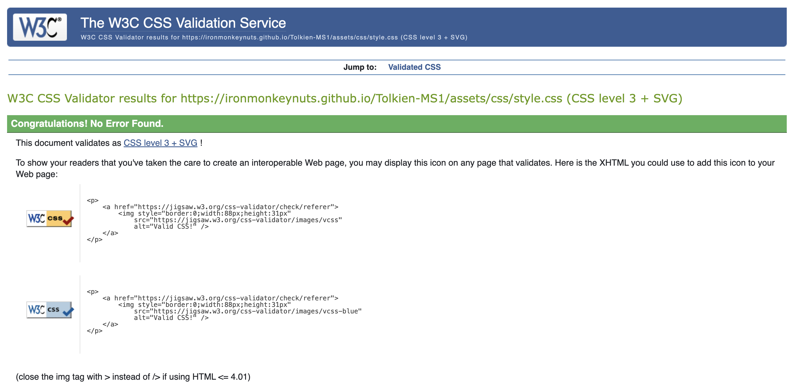
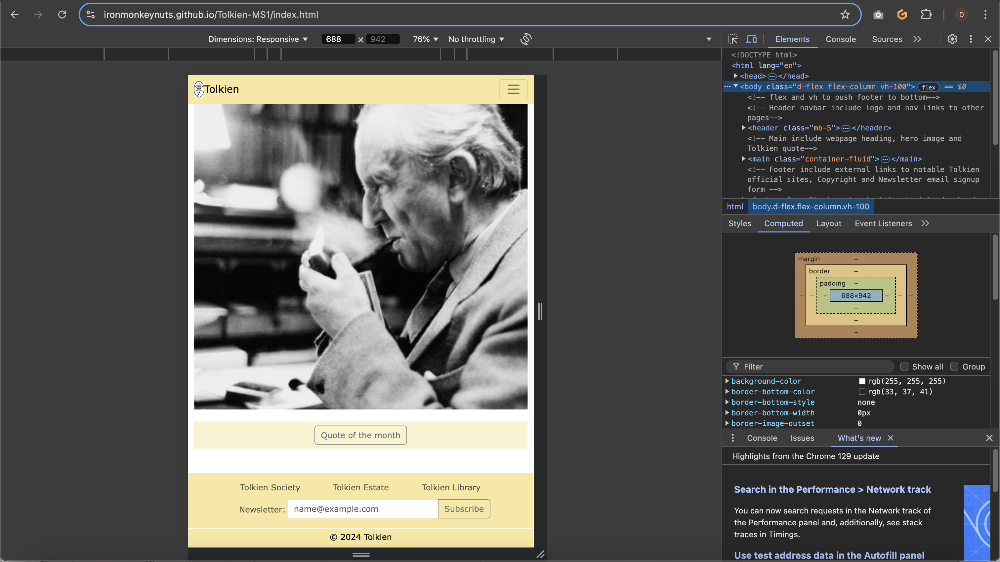
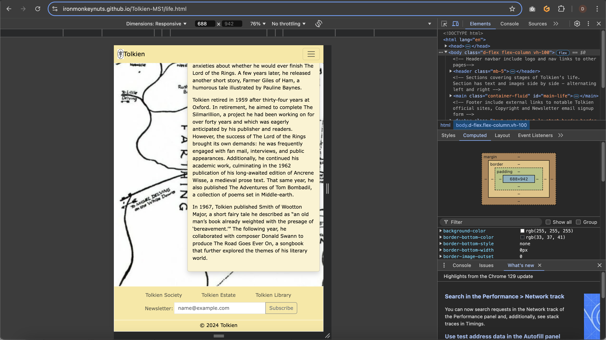

# Testing

> [!NOTE]  
> Return back to the [README.md](README.md) file.

## Code Validation

### HTML

I have used the recommended [HTML W3C Validator](https://validator.w3.org) to validate all of my HTML files.

| Directory | File | Screenshot | Notes |
| --- | --- | --- | --- |
|  | index.html |  | No errors or warnings |
|  | life.html |  | No errors or warnings |
|  | literature.html |  | No errors or warnings |
|  | legacy.html |  | No errors or warnings |

### CSS

I have used the recommended [CSS Jigsaw Validator](https://jigsaw.w3.org/css-validator) to validate all of my CSS files.

| Directory | File | Screenshot | Notes |
| --- | --- | --- | --- |
| assets | style.css |  | No errors or warnings |

## Browser Compatibility

I've tested my deployed project on multiple browsers to check for compatibility issues.

| Browser | Home | Life | Literature | Legacy | Notes |
| --- | --- | --- | --- | --- | --- |
| Chrome |  |  |  |  | Works as expected |
| Edge |  |  |  |  | Works as expected |
| Safari |  |  |  |  | Works as expected |

## Responsiveness

I've tested my deployed project on multiple devices to check for responsiveness issues.

| Device | Home | Life | Literature | Legacy | Notes  |
| --- | --- | --- | --- | --- | --- |
| Mobile (DevTools) |  |  |  |  | Works as expected |
| Tablet (DevTools) |  |  |  |  | Works as expected |
| Desktop (DevTools) |  |  |  |  | Works as expected |

## Lighthouse Audit

I've tested my deployed project using the Lighthouse Audit tool to check for any major issues.

| Page | Mobile | Desktop | Notes |
| --- | --- | --- | --- |
| Home |  |  | Some minor warnings |
| Life |  |  | Some minor warnings |
| Literature |  |  | Some minor warnings |
| Legacy |  |  | Some minor warnings |

## User Story Testing

| User Story | Screenshot |
| --- | --- |
| As a new site user, I would like a clear indication of the scope of this site, so that I may know what to expect and whether it meets my needs. |  |
| As a new site user, I would like a simple navigation and heading structure, so that I can easily find particular content I am interested in. |  |
| As a returning site user, I would like a page devoted to the life history of Tolkien, so that I may find out about different aspects of Tolkiens life from childhood through to his elder years. |  |
| As a returning site user, I would like a page devoted to the literature and artwork of Tolkien, so that I can discover the genres and style of his writing and artwork. |  |
| As a returning site user, I would like a page that lists aspects of cultural life including films, music, other writers work, other artist's work, and games that have taken inpsiration or influence from Tolkien and his work, so that I can know more about the impact he has had on the wider culture. |  |

## Bugs

- Fixed footer creating overflow conflict and restricting view of scrollable text. As a result of this change it was also necessary to change the background colours on the navbar as they had 50% opacity and this caused poor visibity on the text in the navbar as text in the main scrolled underneath.

        
        

    - To fix this, I removed overflow-auto from main class on each of the pages and gave the navbar a fixed-top class to maintain the navbar on show at the top. To fix secondary issue I add css styles to colour background in the navbar and created brand-color class to the main text. These colours were 100% opaque and thus removed the problem of visibility of text.

- Fixed incorrect labelling in form for newsletter subscription.

    

    - To fix this, I corrected label to match.

- Fixed errors of surplus code picked up by Validator in life.html and literature.html.

    

    - To fix this, I removed surplus " in code on line 69 of life.html and surplus < em > on line 196 in literature.html.

- Fixed error of obsolete code for iframes in legacy.html picked up by Validator.

        

    - To fix this, I removed frameborder atrribute from iframe in legacy.html and created a style in css for iframe to be styled with border 0.

- Fixed error of surplus close button in modal header of modal on index.html.

    

    - To fix this, I removed button close in the modal header.

- Contrast errors found using Wave on all pages including in modal on index and in the footer subscribe form.

    

    - To fix this, I added text-body-dark to modal and changed btn-outline-secondary to btn-outline-dark on modal and footer subscribe form.

## Unfixed Bugs

- On my personal iPhone 13 mobile device I noticed that the background image on life.html is blurring and not really responsive. This issue is not apparant in developer tools using the responsive tool. The background images on life.html and on literature.html are merely wallpapers for the page and are such not important. This issue does not show up in testing on the developer app.

     

    - Attempted fix: Researched ways to improve the responsiveness of the background image but did not find a fix that worked.

> [!NOTE]  
> There are no remaining bugs that I am aware of.